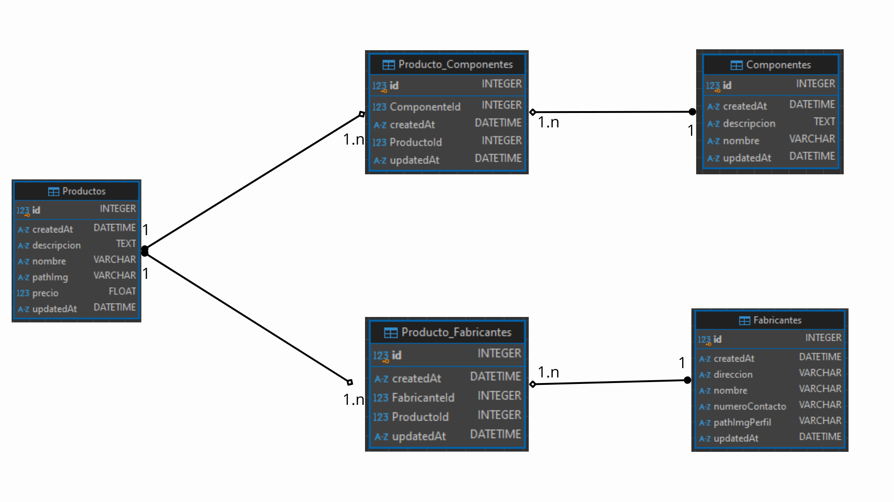

[](https://classroom.github.com/a/NoutYWiV)
# Estrategias de Persistencia - TP 2024

## Descripción
Esta API se desarrolla para que una empresa gestione y administre su inventario de computadoras y sus componentes. Permite almacenar toda la información en una base de datos, agrupando las computadoras con sus componentes y fabricantes correspondientes.

## Requisitos previos
Debes tener instalados los siguientes programas en tu máquina antes de continuar con la instalación:

- [Node.js](https://nodejs.org/) (versión 14.x o superior)

## Instalación

Sigue estos pasos para poner en funcionamiento el proyecto:

1. **Clonar el repositorio**

   Si el proyecto está en un repositorio Git, clona el repositorio en tu máquina con el siguiente comando:

   ```bash
   git clone https://github.com/EP-2024C2/tp-ntom-persistenciaamates24

2. **Instalar dependencias**

   Dirigete hasta la carpeta raíz del proyecto y ejecuta el siguiente comando para instalar las dependencias necesarias:

   ```bash
   npm install

3. **Configurar las variables de entorno(opcional)**

   Navega hasta la carpeta config y manipula el archivo .env para personalizar el puerto a exponer este backend:

   ```bash
   PORT=XXXX

4. **Iniciar el proyecto**

   Una vez que las dependencias están instaladas, inicia el servidor con:

   ```bash
   npm run dev

El servidor estará corriendo en https://localhost:XXXX, donde XXXX es el puerto definido en el archivo .env o **5000** por defecto.

Estas APIs están diseñadas para ser compatibles con cualquier motor de base de datos. Aunque el desarrollo se realizó utilizando SQLite, la API puede configurarse para utilizar el motor de base de datos que la empresa prefiera.


<h2>Relaciones entre entidades:</h2>

- Un Producto puede tener muchos fabricantes, y un Fabricante puede fabricar muchos productos.
- Un Producto puede tener muchos componentes, y un Componente puede formar parte de varios productos.

El siguiente esquema ilustra estas relaciones en un diagrama de entidad-relación:




<h2>La forma de cargar, actualizar o eliminar fabricantes, preductos y componentes son:</h2>

| Verbo  | URL                                           | Codigos de estado      | Descripción                                               |
|--------|-----------------------------------------------|--------------------|-----------------------------------------------------------|
| GET    | https://localhost:XXXX/productos              | 200                | Obtener todos los productos                               |
| GET    | https://localhost:XXXX/productos/:id          | 200, 404           | Obtener un producto en particular                         |
| POST   | https://localhost:XXXX/productos              | 201, 400           | Crear un producto                                         |
| PUT    | https://localhost:XXXX/productos/:id          | 200, 404           | Modificar los datos de un producto en particular          |
| DELETE | https://localhost:XXXX/productos/:id          | 200, 404, 500      | Borrar un producto en particular                          |
| POST   | https://localhost:XXXX/productos/:id/fabricantes | 201, 404, 400     | Crear la asociación de producto con 1 o N fabricantes     |
| GET    | https://localhost:XXXX/productos/:id/fabricantes | 200, 404          | Obtener todos los fabricantes de un producto              |
| POST   | https://localhost:XXXX/productos/:id/componentes | 201, 404, 400     | Crear la asociación de producto con 1 o N componentes     |
| GET    | https://localhost:XXXX/productos/:id/componentes | 200, 404          | Obtener todos los componentes de un producto              |
| GET    | https://localhost:XXXX/fabricantes            | 200                | Obtener todos los fabricantes                             |
| GET    | https://localhost:XXXX/fabricantes/:id        | 200, 404           | Obtener un fabricante en particular                       |
| POST   | https://localhost:XXXX/fabricantes            | 201, 400           | Crear un fabricante                                       |
| PUT    | https://localhost:XXXX/fabricantes/:id        | 200, 404           | Modificar los datos de un fabricante en particular        |
| DELETE | https://localhost:XXXX/fabricantes/:id        | 200, 404, 500      | Borrar un fabricante en particular                        |
| GET    | https://localhost:XXXX/fabricantes/:id/productos | 200, 404          | Obtener todos los productos de un fabricante              |
| GET    | https://localhost:XXXX/componentes            | 200                | Obtener todos los componentes                             |
| GET    | https://localhost:XXXX/componentes/:id        | 200, 404           | Obtener un componente en particular                       |
| POST   | https://localhost:XXXX/componentes            | 201, 400           | Crear un componente                                       |
| PUT    | https://localhost:XXXX/componentes/:id        | 200, 404           | Modificar los datos de un componente en particular        |
| DELETE | https://localhost:XXXX/componentes/:id        | 200, 404, 500      | Borrar un componente en particular                        |
| GET    | https://localhost:XXXX/componentes/:id/productos | 200, 404          | Obtener todos los productos de un componente              |
